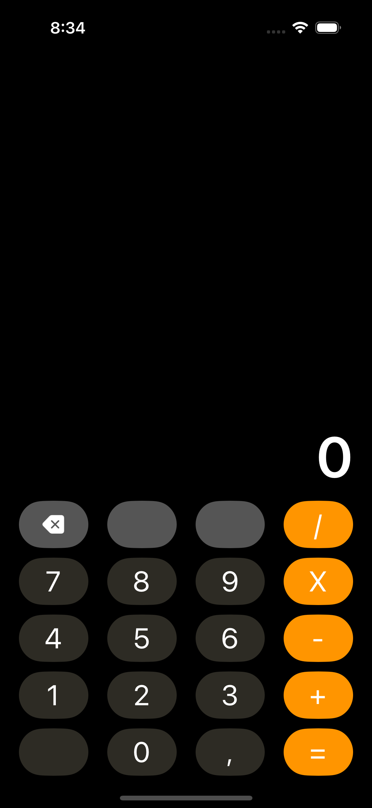

# Calculator app

A calculator inspired on the Casio clasic calculator

| LaunchScreen | Main |
|--------|------|
|   |  |

## Features
* Supports an adaptive design for both portrait mode, as it was created using `UIStackView` and `Autolayout`.
* Includes a UI component to display digits.
* Performs operations such as addition, subtraction, division, and multiplication.
* Includes a clear button to start new calculations.
* Includes a button for a comma to perform decimal calculations.