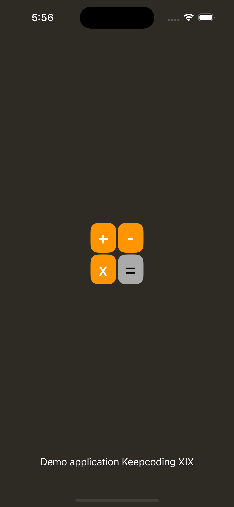

# Calculator app

A basic calculator inspired on the classic Casio 

| LaunchScreen | App |
|--------|------|
|   |  |

## Features
* Supports an adaptive design for both portrait mode, as it was created using `UIStackView` and `Autolayout`.
* Includes a UI component to display digits.
* Performs operations such as addition, subtraction, division and multiplication.
* Includes a clear button to start new calculations.
* Includes a button for a comma to perform decimal calculations.
* Includes localization support for decimal separator

| Locale Support | Spain |
|--------|------|
|   |  |